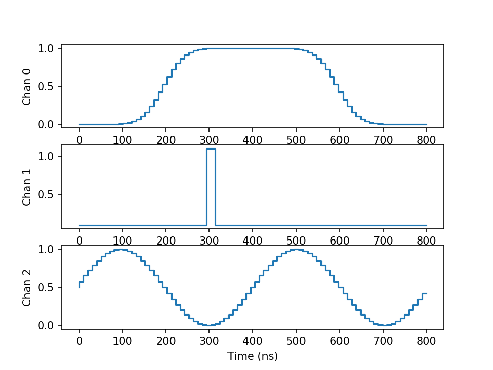
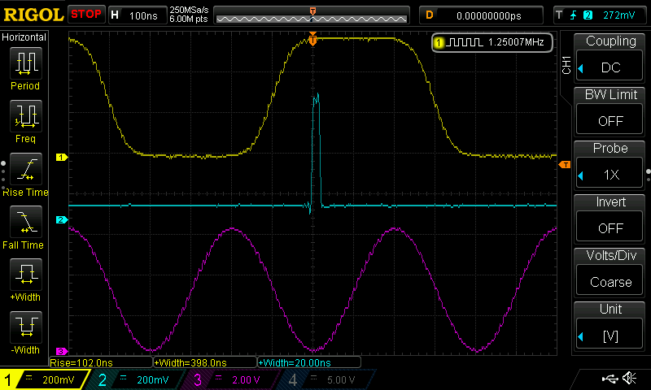

# arbitrary-waveform-generator
Define and generate waveforms to output with your favorite DAC

This python module lets you define synchronized waveforms and sample them to be output through a multi-channel DAC. So far, the code maily targets the the FL2k USB-to-VGA dongle using [osmo-fl2k software](https://osmocom.org/projects/osmo-fl2k/wiki), although the code could easily be modifed to output other formats. At the moment, the output is in an 8-bit signed format for use with osmo-fl2k.

## Example Usage
See [example.py](example.py) for more details on usage, but the main points are highlighted here:

**Define the number of channels and pre-equalization.** You can select the number of channels to be defined. Additionally, you can opt to use DAC pre-equalization to flatten the DAC response. This compensates for the effect of the DAC's zero-order hold, which rolls off high frequencies. See [this page from Maxim](https://www.maximintegrated.com/en/app-notes/index.mvp/id/3853) for more details.

```
    # create 3 waveform channels
    arb = arbgen.Arbgen(channels=3, pre_equalize=False, equalization_taps=7)
```
 
 **Create waveforms.** First, select a channel to define. Next, you may set the output value, define a delay until the next event, define one of several types of edges and pulses, define sine waves, or supply your own mathematic function to define the waveform. In this case, we'll create a 400 ns wide Gaussian pulse with 100 ns rise and fall times:
 
 ```
    # define a 400 ns Gaussian-edged pulse wih 100 ns transitions
    arb.channel(0)
    arb.setValue(0)
    arb.delay(200e-9)
    arb.posPulse(shape='Gaussian', rise_time=100e-9, fall_time=100e-9,
                 width=400e-9, amplitude=1)
    arb.delay(200e-9)
```
Pulse edges are defined by the 50% amplitude point by default (this can be changed with other parameters to the call), so the pulse edge is 200 ns after the start of the waveform in this example. The rise and fall times are measured at the 10% and 90% amplitude points by default (this can be changed), and the pulse width is measured at the 50% amplitude points. Pulse and edge shapes can be Gaussian, ramp (linear), exponential (RC), or square.

**Save Sampled Waveforms.** The example code saves the waveforms to three files. One call is shown here.

```
 # save sample
    arb.save(filename='chan0.dat',
             channel=0, sample_rate=sample_rate, cycles=cycles)
```

**Preview Waveforms.** The example code plots the output waveforms as sampled at 100 MS/s. The plot is shown here:


**Output Waveforms.** The osmo-fl2k library was used to output the example waveforms at 100 MS/s. No filtering was used at the output of the DACs. The result is shown in the following oscilloscope image. Note that the pulse widths and rise times correspond very closely to those defined in the code.


